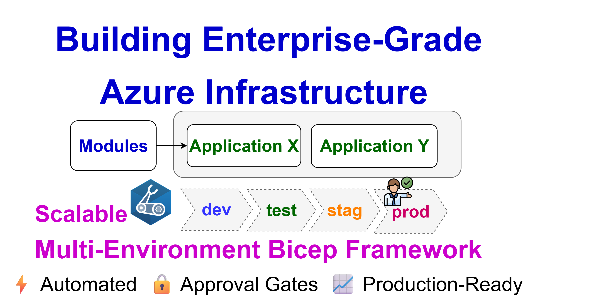
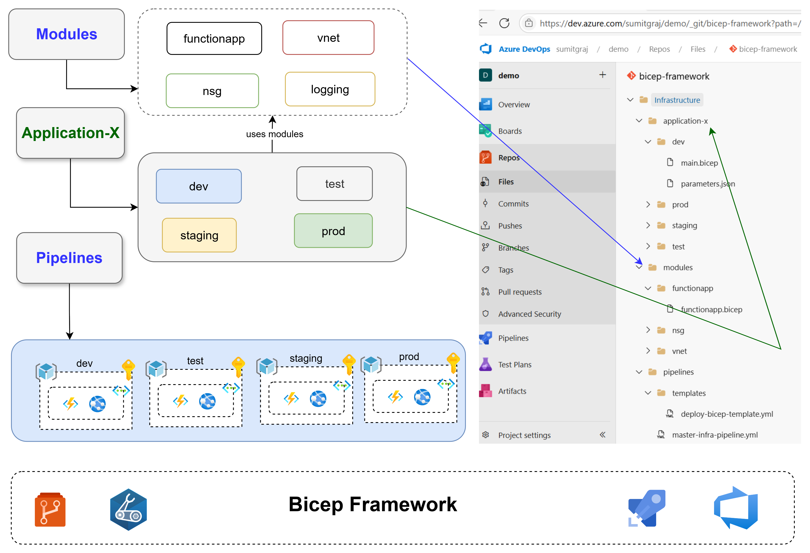
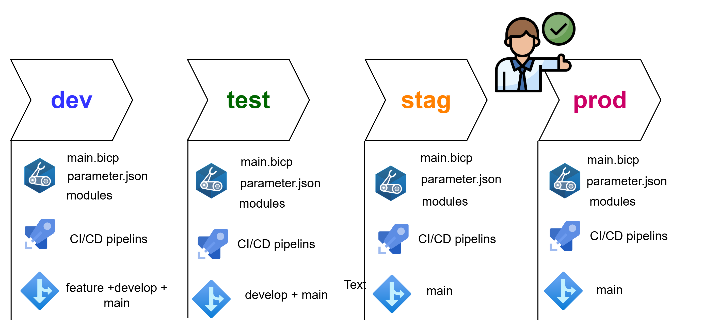

# Introduction 
Follow this Blog with demo -->

https://www.letsdevops.net/post/how-i-built-a-scalable-multi-environment-azure-infrastructure-pipeline-a-real-world-bicep-framework

# Getting Started

# Stages

